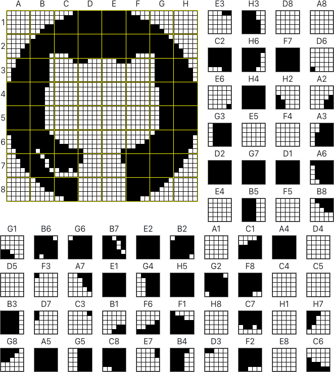

# Pixel Puzzles

Copy each square's pattern to the associated coordinates to reveal a secret image! Fill the grid in your browser or print the puzzle to complete by hand. Edit the puzzle or generate your own using any image. Share puzzles with your friends and family!

Inspired by [Pencil Puzzles](https://web.archive.org/web/20111027002447/http://www.tipstricks.com/puzzles.html) from [Tips & Tricks Magazine](https://en.wikipedia.org/wiki/Tips_%26_Tricks_(magazine)).

## Functionality

### Playing

When you first load the application, you will be presented with the sample puzzle shown above. You can toggle pixels on and off using your mouse. When a square has all of its pixels filled out properly, the square's border will light up. You can erase your progress and start over by refreshing the page or selecting *Clear*. You can also *Reveal* the solution.

### Editing

Selecting *Edit* will **reveal the solution to the puzzle you are currently solving**. Afterwards, you can modify the puzzle by toggling pixels using your mouse just as you would when playing. Selecting *Clear* will empty the canvas, allowing you to create a puzzle from scratch.

By default, the canvas is an 8x8 grid, containing 5x5 subgrids. You can change either of these sizes to any value between 2x2 and 9x9. This will also empty the canvas.

You can also *Import* a puzzle from an image. Select an image from your machine to generate the puzzle. Every pixel will either be on or off, so high contrast images work best. If the image is not square, you can *Stretch to Fit* (changes aspect ratio to 1x1) or *Resize Canvas* (maintains aspect ratio, but will not fill entire canvas).

If you would like, you can *Export* the current canvas as an image. Importing the image will result in the canvas being restored.

Clicking *Invert* will replace all filled pixels with empty pixels and vice-versa. This can be useful if an imported image was not colored as expected.

Whenever you are done editing your puzzle, you can click *Play* to solve it.

### Printing and Sharing

While playing or editing a puzzle, you can click *Print* to generate a printable version of the puzzle or *Share* to copy a link for the puzzle to your clipboard.

## Available Scripts

In the project directory, you can run:

### `yarn start`

Runs the app in the development mode.\
Open [http://localhost:3000](http://localhost:3000) to view it in the browser.

The page will reload if you make edits.\
You will also see any lint errors in the console.

### `yarn test`

Launches the test runner in the interactive watch mode.\
See the section about [running tests](https://facebook.github.io/create-react-app/docs/running-tests) for more information.

### `yarn build`

Builds the app for production to the `build` folder.\
It correctly bundles React in production mode and optimizes the build for the best performance.

The build is minified and the filenames include the hashes.\
Your app is ready to be deployed!

See the section about [deployment](https://facebook.github.io/create-react-app/docs/deployment) for more information.
